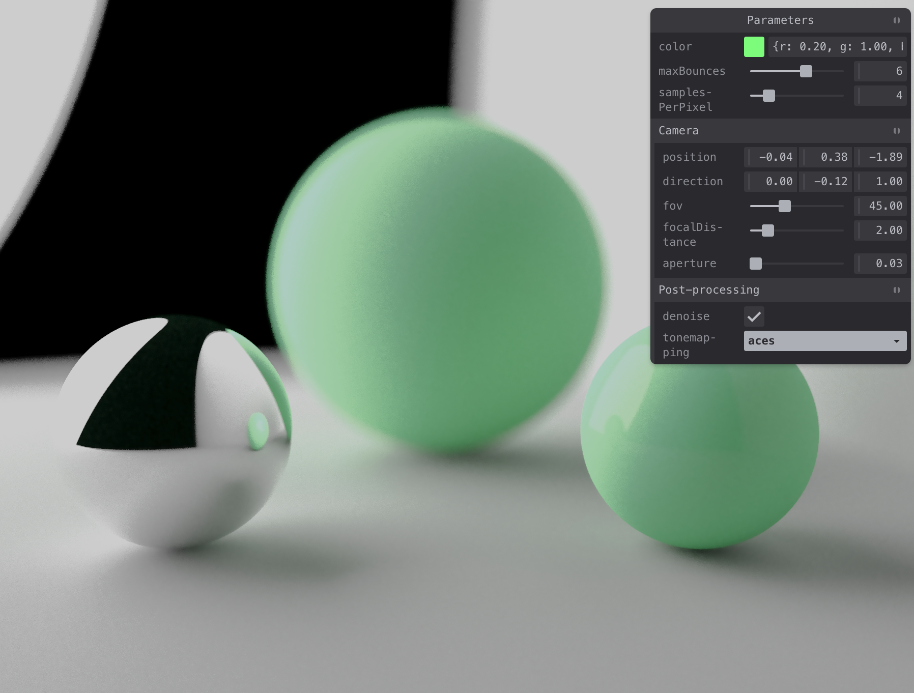

 

<h1 align="center">WebGPU Pathtracer</h1>
<h3 align="center">✨ A simple pathtracer running in the browser using WebGPU. ✨</h3>

 

  

  <i>Click the image above to see the <a href="https://webgpu-pathtracer.vercel.app/">live demo!</a></i>

 

## Features

- [x] 💡 Indirect lighting
- [x] 🫨 Depth of field
- [x] 🎨 Tone-mapping
- [x] 🌫️ Denoising
- [x] 📸 Camera controls
- [x] 🔺 Triangle meshes
- [x] 📦 Bounding volume hierarchies (BVH)
- [x] 🗺️ Environment maps
- [ ] 🪙 PBR materials
- [ ] 🤹 Multiple importance sampling (MIS)

## Getting Started

### Prerequisites

- [Node.js](https://nodejs.org/en/download/) (v18 or higher)

### Installation

1. Clone repo
2. Run `corepack enable` to setup Yarn
3. Run `yarn install` to install dependencies
4. Run `yarn dev` to start the development server

## Credits

Heavily based on:

- https://github.com/visionary-3d/raytracing-bloom-video/
- https://www.youtube.com/watch?v=Qz0KTGYJtUk
- https://webgpu.github.io/webgpu-samples
- https://webgpufundamentals.org/
- https://github.com/gkjohnson/three-gpu-pathtracer
- https://github.com/dmnsgn/glsl-tone-map
